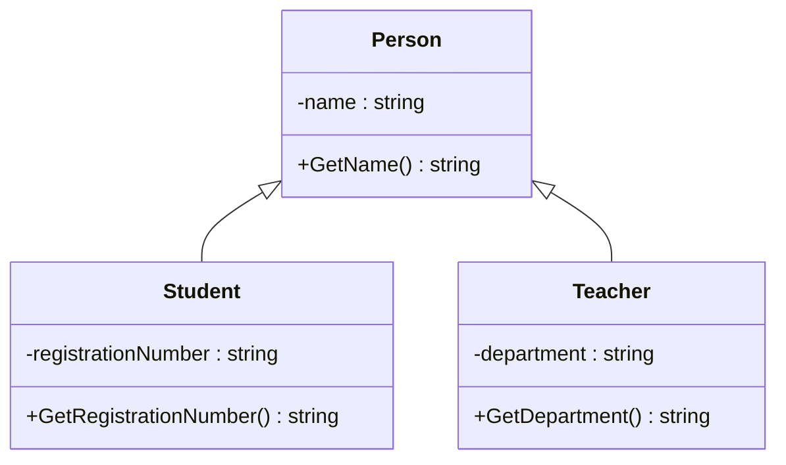
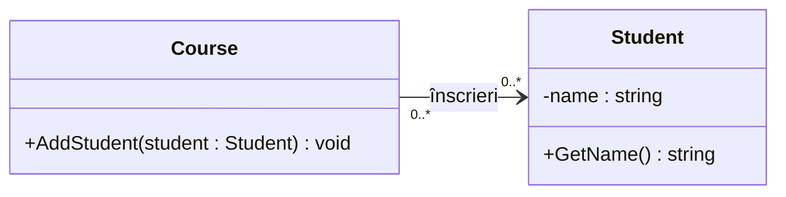

# Moștenirea

Abilitatea unei clase de a moșteni atributele și metodele altei clase. Crearea de clase noi prin abstractizarea atributelor și comportamentelor comune.

## Obiective
* înțelegerea moștenirii
* reprezentarea unei ierarhii de clase printr-o diagramă UML
* reprezentarea asocierii dintre obiecte și a multiplicității acesteia

## Diagrama UML de clase

O diagramă de clase UML (Unified Modeling Language) reprezintă structura unui model: clasele, principalele atribute și metode și relațiile dintre clase. O folosim înainte de implementare pentru a decide ce responsabilități are fiecare clasă și ce elemente sunt comune.

### Notația de bază

O clasă se reprezintă printr-un dreptunghi cu trei compartimente: numele clasei, atributele și metodele.

| Element | Notație | Exemplu |
| --- | --- | --- |
| Atribut | `nume: Tip` | `-name: string` |
| Metodă | `Nume(parametru: Tip): TipReturnat` | `+GetName(): string` |
| Vizibilitate publică | `+` | membru accesibil din exteriorul clasei |
| Vizibilitate privată | `-` | membru accesibil doar în clasa care îl declară |
| Vizibilitate protejată | `#` | membru accesibil în clasa care îl declară și în clasele derivate |

Moștenirea, numită **generalizare** în UML, se reprezintă printr-o linie continuă cu un triunghi gol orientat **spre clasa de bază**. Relația se citește „este un”: un `Student` este o `Person`.

### Exemplu de moștenire

Numele și metoda `GetName` sunt definite în `Person`, deoarece sunt comune ambelor specializări. `Student` adaugă numărul matricol, iar `Teacher` adaugă departamentul. În C#, relația dintre `Student` și `Person` se declară prin `class Student : Person`.

Membrii moșteniți nu trebuie repetați în fiecare clasă derivată din diagramă. Câmpul privat `name` nu poate fi accesat direct din clasele derivate; acestea pot folosi metoda publică `GetName()`.

### Asocierea dintre clase

O **asociere** reprezintă o legătură între obiectele unor clase. De exemplu, un `Course` păstrează referințe la studenții înscriși. Relația nu este una de moștenire: un curs nu este un student.

În UML, asocierea se reprezintă printr-o linie continuă. O săgeată simplă poate indica direcția de navigare: în exemplul de mai jos, cursul poate accesa studenții înscriși. Numerele de la capete indică **multiplicitatea**, adică numărul de obiecte care pot participa la relație.

În acest exemplu, un curs poate avea zero sau mai mulți studenți, iar un student poate fi înscris la zero sau mai multe cursuri. `0..*` înseamnă „zero sau mai multe”, iar `1` ar însemna „exact unul”.

În cod, `Course` poate păstra o listă privată `List<Student>` și poate oferi metoda `AddStudent`. Linia din diagramă reprezintă această legătură; nu este necesar să desenăm și clasa `List`. Eliminarea unui student din lista cursului nu înseamnă distrugerea obiectului student.

Simpla păstrare a unei referințe sau a unei liste nu implică **compoziție UML**. Compoziția, reprezentată printr-un romb plin la capătul întregului, exprimă o relație mai puternică întreg–parte, cu proprietate exclusivă și un ciclu de viață legat de întreg. Pentru exemplul de aici este suficientă asocierea simplă.

Diagrama poate fi desenată de mână sau realizată într-un instrument precum **Visual Paradigm**. Includeți doar elementele relevante pentru design; nu este necesar să reproduceți fiecare detaliu al codului.

## Cerință

Crearea unei ierarhii de clase care să modeleze diferitele tipuri de colete furnizate de o companie de transport. 

Există trei tipuri de colete, cu costuri și timpi de livrare diferite: 
* Pachetul de bază: costă 5 EUR pe kilogram și este livrat în 5 zile. Dacă greutatea pachetului este mai mare de 10 kilograme, este necesară încă o zi. 
* Pachet avansat: costă 6 EUR per kilogram cu o taxă suplimentară de 2 EUR. Pachetul se livrează în 2 zile.  
* Pachet peste noapte: Livrat a doua zi și costă 10 EUR pe kilogram. 

Creați o clasă `Company` care gestionează o listă privată de colete. Lista trebuie să poată conține colete din toate cele trei categorii, folosind tipul de bază comun. Adăugarea se face prin metoda `AddPackage`. Oferiți o modalitate de a parcurge coletele pentru afișare, fără a expune lista internă pentru modificare directă.

**Înainte de implementare**, realizați o diagramă UML pentru ierarhia de colete și clasa `Company`. Includeți clasele, principalele atribute și metode, vizibilitatea acestora, relațiile de moștenire și asocierea dintre companie și tipul de bază al coletelor. Marcați `0..*` la capătul coletelor: compania poate gestiona zero sau mai multe colete. Identificați ce elemente sunt comune și ce aparține fiecărui tip de colet. Diagrama poate fi desenată de mână sau realizată în Visual Paradigm ori într-un alt instrument.

Implementați soluția pornind de la diagramă și actualizați diagrama dacă design-ul se modifică. La final, explicați pe scurt alegerea clasei de bază și a elementelor comune.

În metoda principală, creați o companie și adăugați colete din fiecare categorie prin `AddPackage`. La sfârșit, parcurgeți coletele companiei într-o buclă și afișați-le.

## GitHub Copilot

### Base Class

A base class, also known as a superclass or parent class, is a class that serves as a foundation or blueprint for other classes. It contains common attributes and behaviors that can be inherited by its derived classes.

By using a base class, you can avoid duplicating code and promote code reusability. It allows you to define common functionality in one place and have it automatically available in all derived classes. This makes your code more organized, maintainable, and scalable.

### Child Class

A child class, also known as a derived class or subclass, is a class that inherits properties and behaviors from a base class. It extends the functionality of the base class by adding its own unique attributes and methods.

To create a child class in C#, you can use the : symbol followed by the name of the base class. This establishes an "is-a" relationship, where the child class is a specialized version of the base class.

